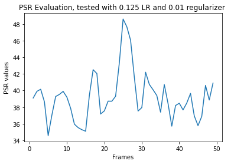

# Visual Tracking Project
This software is an implementation of visul tracking filter called Mosse Filter by this paper:   
https://www.cs.colostate.edu/~vision/publications/bolme_cvpr10.pdf   

The program is developed using python.   
# To run:   
- Run main.py
- The test video will open, then select the object you want to track by moving your mouse around the object. You need to do it twice, the first time you select your  then you press space to select the object again and then press space again to start tracking. 
- The test has been done on two videos Look at this video:  
https://www.loom.com/share/5f0031442c244a32b865c71ac154dd8d   

It can be noticed the tracking quality is not good and sometimes the tracking window diverge from the object, some time changing the parameters like the learning rate and the regularizer affect the quality and make a better tracking.   
The program is commented and each step is explained. See the PSR evaluation below:   

  

The PSR evaluation can asess the quality of the filter, as the paper says if the values of the PSR between the 20 and 60 it means that the filtes is tracking good. 

